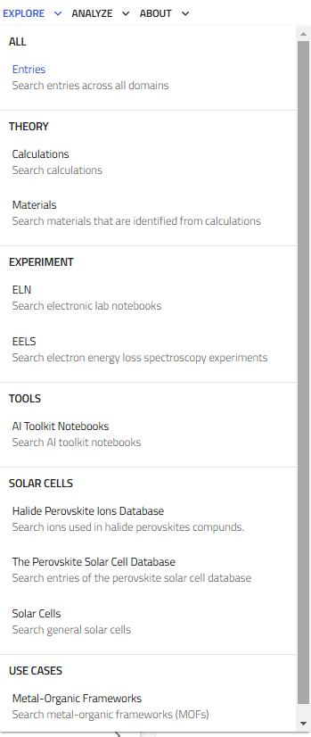
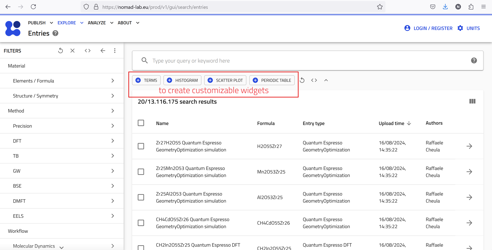
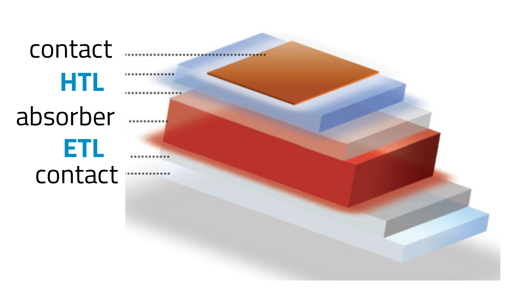

# Explore Data in NOMAD

The **EXPLORE** menu allows you to navigate and search through a vast amount of materials-science data. Currently, the this menu offers several options for exploring data including:

- **Entries**: Search entries across all domains.
- **Theory**: Focus on calculations and materials data derived from theoretical models.
- **Experiment**: Explore data from experimental sources, such as ELNs (Electronic Lab Notebooks) or characterization techniques e.g., EELS (Electron Energy Loss Spectroscopy).
-  **Tools**: Explore among several AI toolkit notebooks.
- **Use Cases**: Search data tailored to specific use cases, such Metal-Organic Frameworks (MOFs).

    

Here we focus on searching data in NOMAD using the **Entries** option within the **EXPLORE** menu. You will see an overview of **SOLAR CELLS**, using **The Perovskite Solar Cell Database**.

---

## Exploring Entries in NOMAD

To explore NOMAD, go to **EXPLORE** → **Entries**.

The **Entries** page shows the latest uploaded data. Public entries are accessible without login, while logging in grants access to private and shared entries.

---

### Search Interface & Filters

NOMAD supports advanced searches based on:

- **Material** – Elements, formula, or structure.  
- **Method** – Scientific techniques (e.g., DFT).  
- **Properties** – Band structure, conductivity, etc.  
- **Use Cases** – Application-specific searches (e.g., Solar Cells).  
- **Origin** – Filter by uploader, date, dataset, or tags.

    

Filters refine searches dynamically. Example:

- **Material Filter**: Select **B** and **N** to find hexagonal boron nitride.
- **Method Filter**: Find **BN** simulations using **VASP**.
- **Properties Filter**: Search for entries with **band structure** data.

You can pin frequently used filters using **(+)** for a customized search interface.

    

---

### Search Bar: A Quick Way to Explore Data

The search bar helps locate filters efficiently. Typing a keyword suggests related filters.

??? question "Does NOMAD have a bandgap filter?"
    Can you find a filter for bandgap? Does it provide the bandgap value or indicate direct/indirect nature?

??? tip "Hint"
    - Try variations like **"bandgap"**, **"band gap"**, or **"band_gap"**.
    - Search for **"direct"** or **"indirect"** to explore bandgap characteristics.

---

### Custom Widgets for Advanced Searches

NOMAD enables searching entries using rich metadata. Some metadata is extracted automatically, while others are user-provided via schemas. Only metadata stored according to schemas is searchable.

NOMAD also offers **custom widgets** to create advanced dashboards. These widgets are accessible below the search bar on any **EXPLORE** page.

    

Here are the main four widgets:

- **TERMS:** Visualize and explore categorical data based on user-defined terms and keywords.
- **HISTOGRAM:** Display the distribution of a specific numerical quantity within data.
- **SCATTER PLOT:** Generate scatter plots to visualize relationships between different quantities.
- **PERIODIC TABLE:** Filter data by selecting elements directly from an interactive periodic table.

---

## Example 1: Finding Alternative ETL Materials for Perovskite Solar Cells

In the following, we'll walk you through an example to help you better understand how to use these widgets. Imagine we are working on solar cell research and have fabricated solar cell devices using the absorber material 'CsPbBrI' (Cesium Lead Bromine Iodide), a mixed halide perovskite. The device's structure is illustrated below:

    

### The Device:

- **Contact:** Au
- **HTL (Hole Transport Layer):** Spiro-OMeTAD (C81​H68​N4​O8​)
- **Perovskite Absorber:** CsPbBrI
- **ETL (Electron Transport Layer):** TiO2-c (compact Titanium Dioxide)
- **Contact:** FTO (Fluorine-doped Tin Oxide)
- **Substrate:** SLG (Soda Lime Glass)

Now, we want to answer the following research question:

**What ETL materials can replace TiO2-c to improve Voc (open circuit voltage) in perovskite solar cells?**

To gain insights into this question, we can utilize NOMAD's widgets to explore relevant data:

1. **Start with the Periodic Table**:
    - Click on the **PERIODIC TABLE** widget button and use the **(+)** button to pin it to the dashboard.
    - Select the elements of the absorber from the periodic table: Cs, Pb, Br, and I.
    - After selecting these elements, you should see approximately 7,500 entries matching your search filters.

2. **Use the TERMS Widget**:
    - To find out what ETL and HTL materials are used in the available data, click on the **TERMS** widget button.
    - For the X-axis, type 'electron transport layer'. As you type, suggestions will appear. Choose `results.properties.optoelectronic.solar_cell.electron_transport_layer`.
    - Set the statistics scaling to linear, give the widget a descriptive title like "ETL", and pin it to the dashboard.
    - Repeat the process for the HTL materials.

3. **Create a Scatter Plot**:
    - Click on the **SCATTER PLOT** widget button to visualize the relationship between open circute voltage (Voc), short circuit current density (Jsc), and efficiency.
    - Set the X-axis to "Open Circuit Voltage (V)", the Y-axis to "Efficiency", and use the marker color to represent "Short Circuit Current Density".
    - The scatter plot will allow you to explore the data interactively.

    

### Interpreting Results  
- Interactive scatter plots reveal relationships between **ETLs, HTLs, and performance**.  
- Hover over data points for details.  
- Click entries for **full metadata, dataset links, and publication info**.  

Custom widgets provide a **powerful way** to explore NOMAD data and answer research questions efficiently.

---

## Example 2: Exploring Sn-Based Solar Cells

Let’s explore how **hole transport layer (HTL) materials** affect efficiency in **Sn-based solar cells** with **C60** as the electron transport layer (ETL).

    

### Step 1: Open the Perovskite Solar Cell Database Dashboard  
- Navigate to **EXPLORE** → **Solar Cells** → **Perovskite Solar Cells Database**.  
- This dashboard provides predefined filters and plots optimized for solar cell research.

    

### Step 2: Understand the Dashboard  
The dashboard includes:
- **Periodic Table** – Filter materials by elements.  
- **Scatter Plots** – Explore efficiency vs. **Voc**, **Jsc**, and **device architecture**.  
- **Histograms** – Analyze bandgap and illumination intensity.  
- **TERMS Plots** – Categorize **fabrication method**, **device stack**, **ETL**, and **HTL** materials.  

### Step 3: Apply Filters  
1. Select **Sn** in the **Periodic Table** to filter Sn-based absorbers.  
2. Set **ETL = C60** in the **TERMS** plot. (~400 entries remain)  
3. Narrow results further using:
   - **Bandgap slider** (e.g., >1.3 eV).  
   - **Device architecture scatter plot** (e.g., pin).  

### Step 4: Customize Widgets  
- Click the **pen icon** on any widget to modify its plotted quantities, color mapping, or units.  

### Step 5: Explore and Analyze Results  
- **Hover over scatter plots** to inspect data points.  
- **Click entries** for full metadata, dataset links, and further analysis.  

    

