To get started in the journey of uploading raw files to publishing datasets with DOI in NOMAD, you will need to understand the key elements of this process in NOMAD:

1. NOMAD Users
2. Uploads
3. Entries
4. Datasets

In order to upload data into NOMAD, a user account is required. 
You can create a user account by following these [steps](materials/CreateaNOMADaccount.pdf).

All files and data created by the users are organized in NOMAD into directories within their user account. These are called **Uploads**. 

You can create an upload for each project, and you can structure them into nested folder directories. 

??? info "Key features of NOMAD **Uploads**"
    - **Creation:** Uploads are created and managed by users.
    - **Structure:** Uploads are associated to a user account and are listed in the *my uploads* page in the GUI. The serve as containers for multiple files and Entries, preserving their directory structure and metadata. 
    - **Organization:** Each upload can contain multiple files organized into directories.
    - **Sharing & Publishing:** Entries and files can only be shared, transferred, or published as complete uploads.

??? info "Key features of NOMAD **Entries**"
    - **Creation:** Entries are automatically generated by NOMAD from uploaded raw files or instantiated schemas.
    - **Structure:** Entries are distinct data entities that can be searched and viewed through dedicated pages in the NOMAD GUI.  
    - **Organization:** Entries belong to specific uploads and are linked to a raw file that NOMAD has recognized and parsed.  
    - **Sharing & Publishing:** Entries can be shared as part of an upload, and individual Entries can be added to datasets, which can be published with a DOI.  

### Where are my uploads?

The uploads exist in the “Your uploads” page. You can reach there by clicking on **uploads** in the **Publish** menu.

Here you can view a list of all your uploads with their relevant information. 

You can also create new uploads or add an example upload prepared by others.

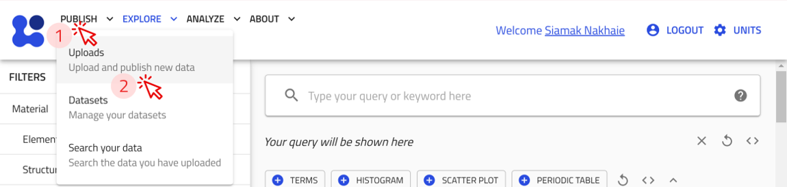

### Task 1: Create new upload

To create a new upload, click on the `CREATE A NEW UPLOAD` button. 

A new page will open and an upload ID will be automatically assigned.

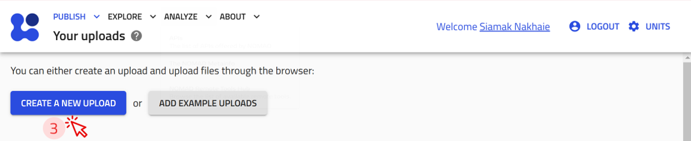

??? info "Two different views of the **upload** page"
    At the very top of the upload page, you can toggle between two different views for this page:
    
    - **Overview:** This view includes all the tools needed to manage your upload, along with guided steps to start uploading your files to NOMAD. It will also show all the processed files (Entries) that you will upload. 
    
    - **Files:** This view shows all the files included in upload, whether they are raw files, or processed files. You can also organize these files into folders as needed. 
    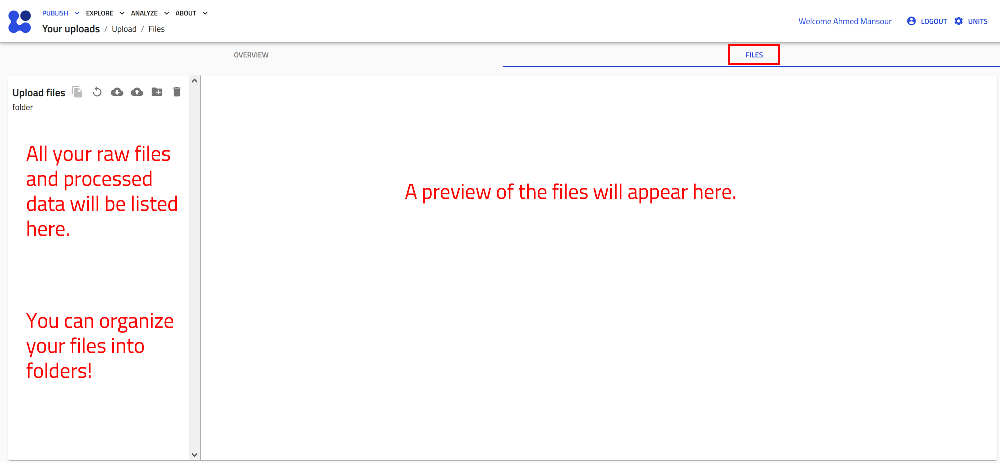

### Task 2: Rename your upload

When you create a new upload, it is automatically assigned the default name *unnamed upload*.

To rename it, click on the  icon next to the name. 

This will make the name field editable, allowing you to enter a clear and descriptive name. Once you're done, click `SAVE` to apply the changes.

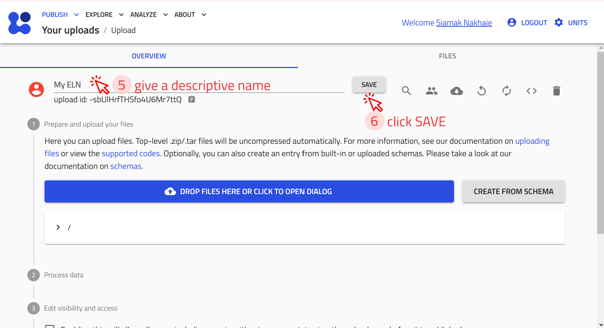

### Task 3: Share your upload with a colleague

Uploads in NOMAD can be shared and published.

When you share/publish an upload, all included entries and files will be shared/published.

??? info "What is the difference between sharing and publishing an Upload?"
    **Sharing an upload** allows you to grant access to colleagues or collaborators while working on it. 
    
    - This facilitates collaboration on projects or enables progress reviews during the project. 
    - You can invite individuals with either read/write access (coauthors) or read-only access (reviewers).

    **Publishing an upload** makes it searchable, findable, and accessible on NOMAD for everyone. 
    
    - Once published, the upload becomes immutable, meaning its contents can no longer be modified. 
    - You also have the option to publish with an embargo period, temporarily restricting public access until the embargo expires. 

A NOMAD upload can have four statuses based on sharing and publishing::

|Status    | Icon   | Description                         |
|----------|--------|-------------------------------------|
|Private   ||The upload is only visible to the uploader only.|
|Shared    | |The upload is accessible to selected users but not publicly available.|
|Published |       |The upload is publicly available to everyone.|
|Visible   |           |The upload is unpublished but accessible to everyone.|

### Task 4: Add files to your upload

Lets start adding files to your NOMAD upload. We will explore three different examples:

1. Miscellaneous Files.
2. Files of DFT and GW calculations on Silicon.
3. Files of X-ray photoelectron spectroscopy (XPS) measurement on polymer materials. 

Adding files to your upload can be done with individual files, or you can group them into a compressed file in `.zip` or `.tar` formats. 

??? info "Different ways and senarious to upload files to NOMAD"
    In NOMAD, files can be uploaded in different ways, but whether they are processed into Entries or not depends on their format and NOMAD’s built-in parsers. Here’s how it works: 

    **Files that are processed by NOMAD**
    
    - These are files that are recognized by NOMAD, meaning that **a built-in parser exists** for the file you uploaded, the file will be processed according to a data schemas. 
    
    - It means that NOMAD reads the file, extracts data and organizes them based on the data schema which allows for generating visualizations, and analysis automations. 
    
    - Raw files that are processed in NOMAD become **Entries**
    
    - This is common for simulation files since they follow standardized structures. Also a variety of experimental data organized in NeXus format `.nxs`, are recognized by NOMAD.

    **Files that are not processed by NOMAD**

    - These are files that **do not have a built-in parser**, meaning NOMAD cannot automatically extract and structure their data.

    - They are still stored in NOMAD as part of your upload, and can be downloaded or shared, but they do not become Entries in the database.

    - NOMAD allows you to preview common file formats that are not automatically parsed. This means you can view the contents of the file directly within the platform without having to download it. Examples include: `.txt`, `.csv`, `.pdf`, `.png`, `.jpg`.

#### Task 4.1: Uploading miscellaneous files

??? example "Download the example files for this excercise"
    We have prepared a set of files for this task that can be downloaded from this [link](https://box.hu-berlin.de/d/92b34ea0e8604e64a079/). 
    
    Download the folder, then uncompress it on your local machine at you preferred directory.

    The folder contains files of the following formats: `.zip`, `.pdf`, `.jpg`, `.txt`, and `.csv`.

    | file name                      | format | description                                                                 |
    |--------------------------------|--------|-----------------------------------------------------------------------------|
    | FAIRmat_graphics               | .zip   | Compressed file that contains several FAIRmat logos in `.png` format        |
    | JOSS_2023                      | .pdf   | A publication of NOMAD in the Journal of Open Source Software               |
    | Nature_2022                    | .pdf   | A publication of FAIRmat in Nature journal                                  |
    | P3HT_optical_absorption        | .csv   | Results of absorption measurement on P3HT from PerkinElmer spectrometer     |
    | note_properties_of_good_dopants| .txt   | Notes recorded during a conference talk                                     |
    | experiment_polymer_doping      | .jpg   | A photograph of an experiment of preparing doped polymer solutions          |

Note that these files will not create entires in NOMAD, because a built-in parser for them doesn't exist. 

They will be stored in your upload and can be accessed and shared with your colleagues, however, they will not be searchable within NOMAD. 

In this case, NOMAD acts as a typical storage cloud!

You can add these files to your NOMAD upload do so by simply drag and drop the file or by opening the dialog to browse the files in your device.

**Drag and drop**

Start with uploading the file `FAIRmat_graphics.zip`. Lets use the drag and drop method as shown in the animation below. 

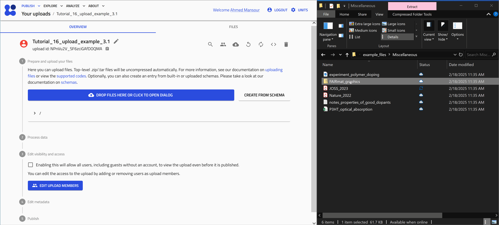

When a compressed file is uploaded to NOMAD, it will be extracted automatically and the included files will be added to your upload.

**Open the file browser dialog**

Upload the remaining files using the file browser dialog as shown in the animation below. 

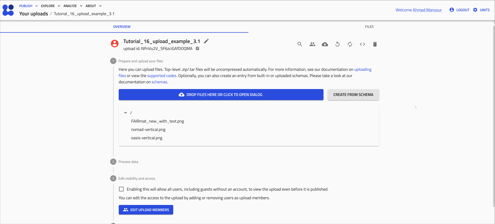

#### Task 4.2: Uploading computations data files

??? example "Download the example files for this excercise"
    We have prepared a set of files for this task that can be downloaded from this [link](https://box.hu-berlin.de/f/f6b51d915fc0435ba9bb/?dl=1). 
    
    Download the folder to your local machine at you preferred directory.

    This folder contains the input and output files of DFT and GW calculations for Silicon using the *exciting* code.

    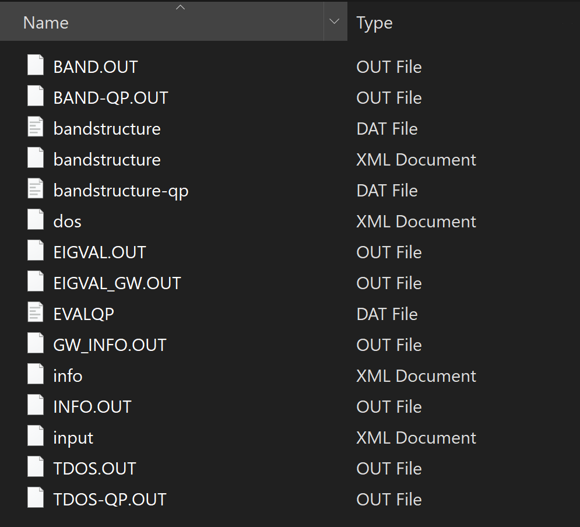

    *exciting* is a full-potential all-electron density-functional-theory package implementing linearized augmented planewave methods. It can be applied to all kinds of materials, irrespective of the atomic species involved and allows for exploring the physics of core electrons. [More information on this link](https://exciting-code.org/)

The calculations in this example were preformed using a code that is supported by NOMAD, i.e. the *exciting* code.  

NOMAD has a parser for the *exciting* code. This means it will create an **Entry** for these data. 

In other words, NOMAD will read exciting input and output files and provide all information in NOMAD's unified Metainfo data schema.

**Uploading the files**

Start with uploading the file `Si_gw.zip`. Lets use the drag and drop method as shown in the animation below. 
TOBECOMPLETED

#### Task 4.3: Uploading experiments data files

??? example "Download the example files for this excercise"
    We have prepared a set of files for this task that can be downloaded from this [link](https://box.hu-berlin.de/d/344e53d8e2f341639739/). 
    
    Download the folder, then uncompress it to your local machine at you preferred directory.

    This folder contains files related to an X-ray photoelectron spectroscopy (XPS) on the polymer PBTTT using SPECS spectrometer. 
    
    It contains the data file in two different formats (`.nxs` and `.xml`), in addtion to an electronic lab notebook (ELN) file (`.yaml`) documenting additional details of the experiment. 

    | file name             | format | description                                                      |
    |-----------------------|--------|------------------------------------------------------------------|
    | PBTTT_XPS_SPECS       | .nxs   | XPS data file in the standard NeXuS file format                  |
    | PBTTT_XPS_SPECS_raw   | .xml   | XPS data in a raw file format as produced by the spectrometer    |
    | ELN_data_xml          | .yaml  | An ELN file used to record additional metadata of the experiment |

NOMAD supports experimental data files in the `.nxs` format.

These files can be uploaded directly to NOMAD, where they are processed, and structured **Entries** are created.

Most scientific instruments generate experimental results in formats other than `.nxs`. NOMAD still supports these files by providing a conversion process using the **NexusDataConverter** built-in schema, which transforms raw data into the `.nxs` format.

 

**Uploading experimental data in the `.nxs` format**

Start with uploading the file `PBTTT_XPS_SPECS.nxs`. Lets use the drag and drop method as shown in the animation below.

The file is parsed by NOMAD and an Entry is created. Clicking on right arrow next to an entry navigates you to the respective entry page.

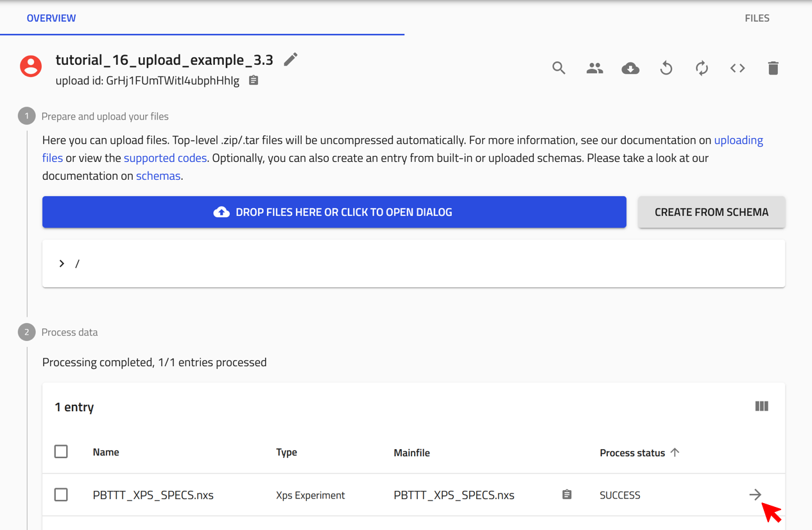

??? info "The main elements of the **Entry** page"
    On the entry page, you will see the detailed informatoin about your entry, divided into 4 main tabs:
    
    - **OVERVIEW Tab:**

        1- On the left, core metadata are displayed.

        2- On the right, various cards present the available information. 
        
        The cards you see depend on the properties or data available for that entry.
        
        For `.nxs` files, two main cards appear in the overview page: the data viewer and the materials card.

        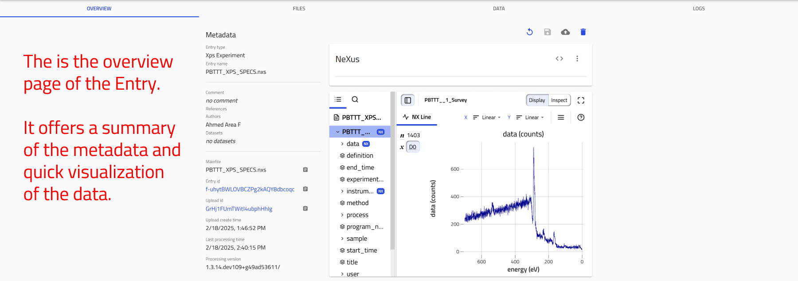

    - **FILES Tab:** 
    
        This tab shows the uploaded files. NOMAD lists all files in the same directory, as they usually belong together.

    - **DATA Tab:**

        Also known as the "processed data" tab, this shows the results of the parsing and normalization process done by NOMAD. 
        
        NOMAD puts all the data in a unified, hierarchical, and machine-processable format, following the NOMAD metainfo.

        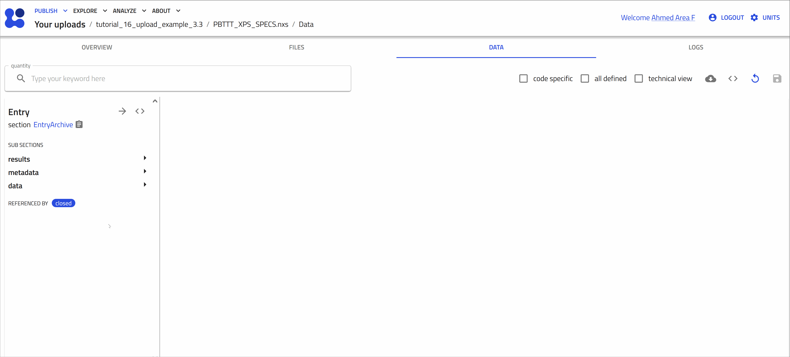

**Uploading experimental data in the `.xml` format**

XPS measurements made with commercially available instruments are not provided with the `.nxs` format. 

One the file formats provided natively by these instrument is `.xml`.

In this exercise, you will learn how to upload a raw file from a SPECS instrument in `.xml` format by using the NexusDataConverter. You will do this in two ways:

1. Uploading only the raw file.
2. Uploading both the raw file and an ELN file, enriching your data with metadata and ensuring compliance with community standards.

**Step 1:** Click on the `CREATE FROM SCHEMA` button in your upload page.

**Step 2:** In the *create new entry from schema* window, click on the drop-down menue of the built-in schema, and select `NexusDataConverter`

**Step 3:** Give a descriptive name for the entry.

**Step 4:** Click on CREATE. This will take you the NexusDataConverter Entry page. 

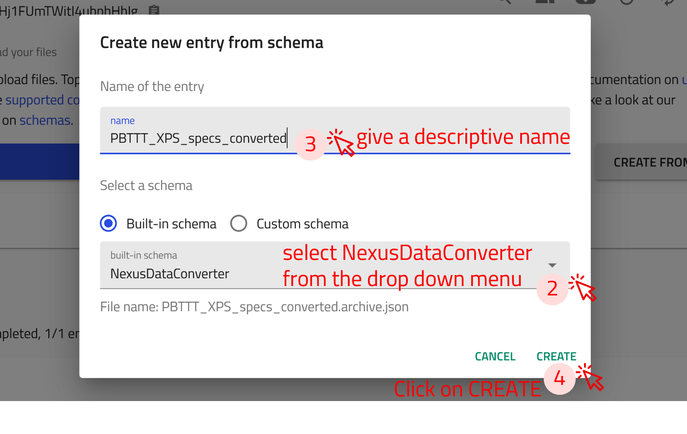

**Step 5:** From the reader drop-down menu, choose the approperiate reader for your files. For this exercise select *xps*.

**Step 6:** From the nxdl drop-down menu, choose the approperiate application definition for your experiment. For this exercise select *NXxps*

??? info "NexusDataConverter readers and the NeXuS application definitions"
    **A Reader** is a program designed to interpret and extract data from a specific experimental technique or file format. 

    The reader understands the structure and encoding of the particular data format and provides methods for accessing its contents in a programmatically friendly way.
    It acts as a bridge between raw experimental data and NOMAD by converting the data into the structured file format according to domain-specific application definitions. 

    A list of available readers can be found [here](https://fairmat-nfdi.github.io/pynxtools/reference/plugins.html)

    **A NeXus application definition** provides a structured specification of the terms and metadata required in an `.nxs` data file for a particular scientific application. These definitions outline the minimum set of terms that must be included in the data file for it to be considered valid according to the NeXus format.

    A list of NeXuS application definitions developed by FAIRmat can be found [here](https://fairmat-nfdi.github.io/nexus_definitions/)

    NexusDataConverter uses **readers** to interpret the raw data files, and then structures them according to the outlines of the **application definitions**

**Step 7:** Upload the raw data file `PBTTT_XPS_SPECS_raw.xml`.

**Step 8:** Give a descriptive name for the generated `.nxs` file.

**Step 9:** Click on the save icon to start the conversion process. 

Check the overview page of your upload. There you will fine two newly created entries; one for the NexusDataConverter and one for the generated `.nxs` file from you your raw file. 

NOMAD still stores your `.xml` raw file in the upload directory. 

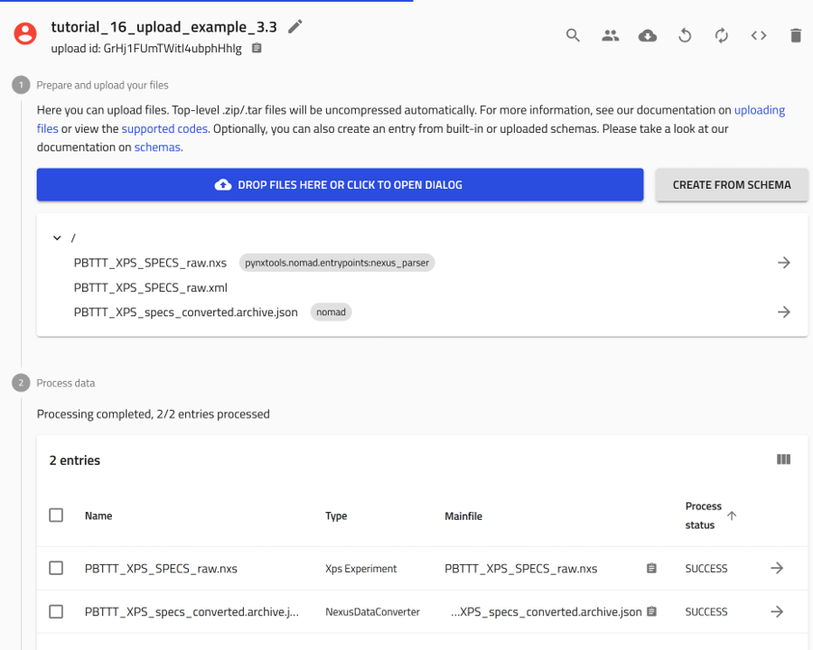

**Uploading experimental data in the `.xml` format with additional ELN data**

TOBECOMPLETED