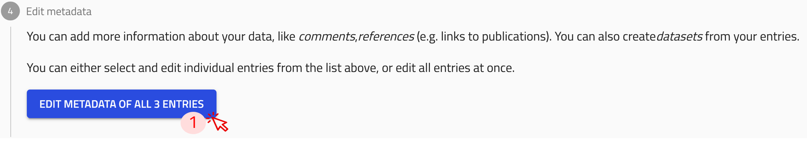
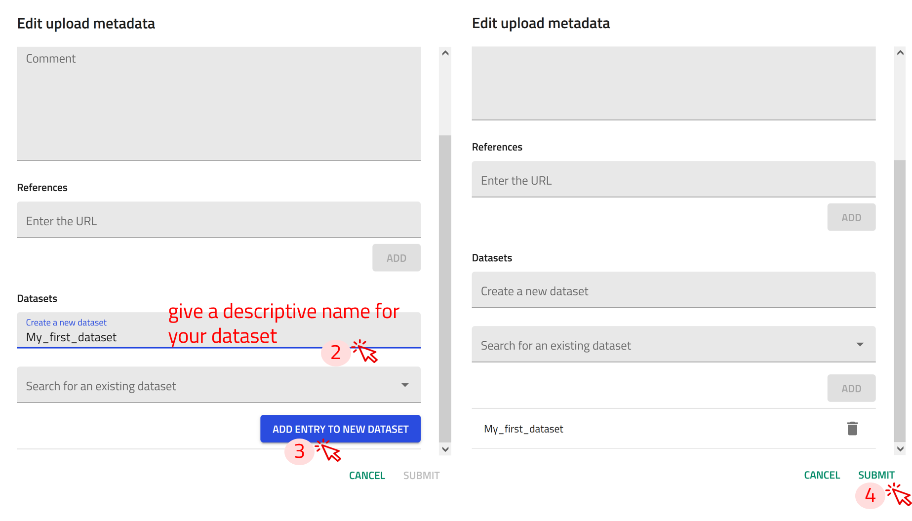
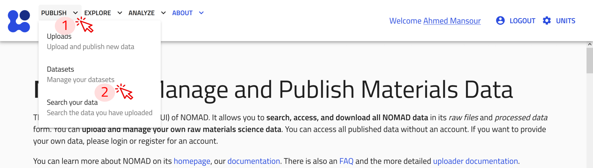
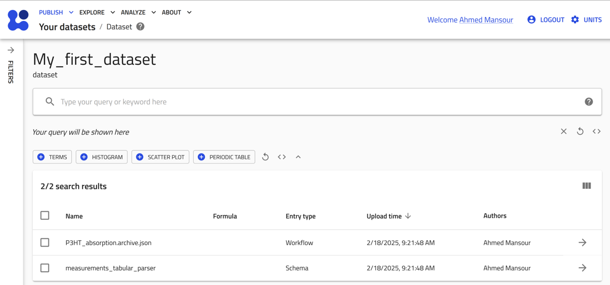
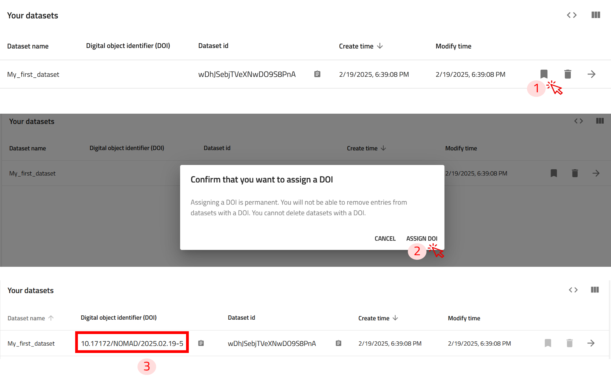

You can organize several entries  by grouping them into common datasets, making it easier to manage related data.

Datasets have no influence on the processing of data and are used to reference a collection of curated data.  

Users can get a DOI for their datasets. 

### Task 1: Group your entires into a Dataset

**Step 1:** In the uploads page, click on `EDIT AUTHOR METADATA OF ALL ENTRIES` button. This will add all the Entries in the upload to the dataset.

Alternatively, if you would like to add selected entries from your Upload, click on the check box next to the entries you would like to add, then click on  to open the EDIT AUTHOR METADATA window for the selected entries only.

**Step 2:** In the Datasets section, you have two options:

- Create a new dataset: If the dataset you want to group your entries under doesn't exist yet, you can create one here.
- Search for an existing dataset: If the dataset already exists, you can search for it by name or other attributes.

**Step 3:** Once you've selected or created the appropriate dataset, click `ADD ENTRY TO NEW DATASET` 

**Step 4:** Click on SUBMIT to to group your entries under that dataset.

### Task 2: Manage your Dataset and assigne it a DOI

User created datasets exist in the “Your datasets page” page. You can reach there by clicking on **Datasets** in the **PUBLISH** menu.

Here you can view a list of all your created datasets with their relevant information and assign them a DOI.

!!! warning "Assigning a DOI makes the dataset permanent—it cannot be modified or deleted."
    If you want to test the process without actually publishing the data, you can do so in the [NOMAD test installation](https://nomad-lab.eu/prod/v1/test/gui/about/information).

Click on the  icon next to the dataset to view entries that are part of the dataset. This will take you to the dataset page, with a list of all entries included. 

You can assign a DOI for your Dataset by clicking on the *ribbon* icon next to the Dataset.

