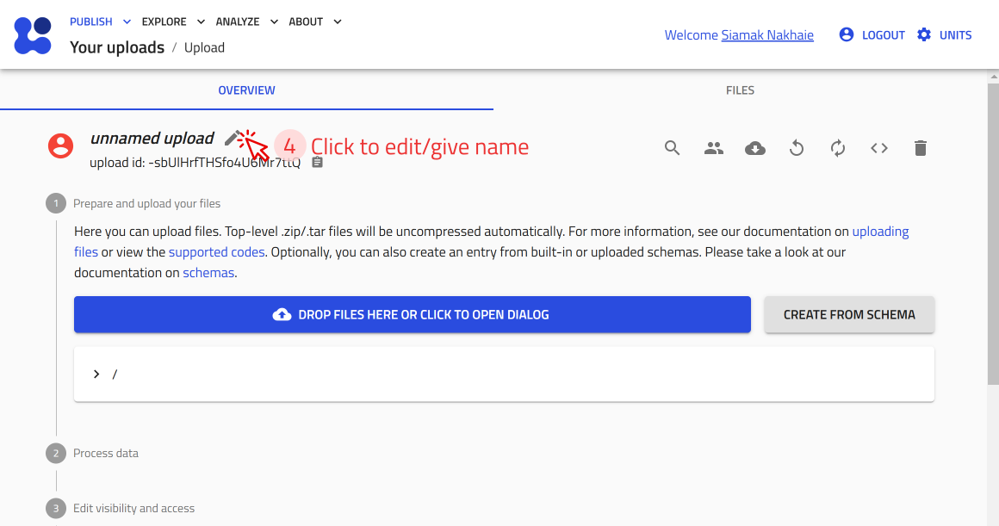
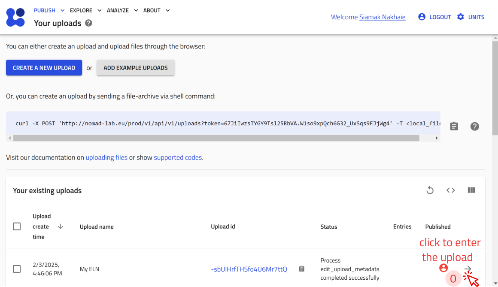
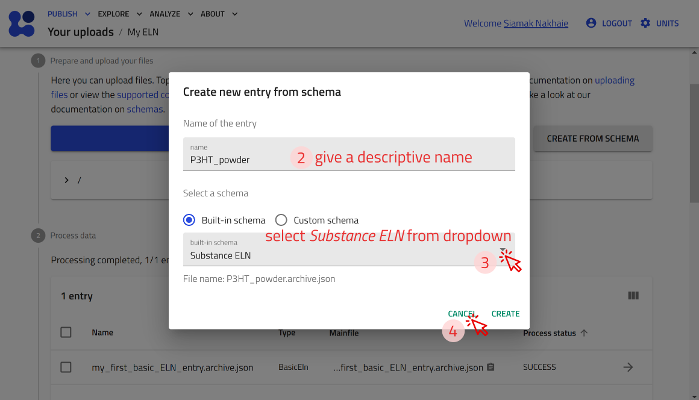

## Create a New Upload

On any page in NOMAD, click **PUBLISH**-> click **Uploads**-> click **CREATE A NEW UPLOAD** -> edit/give name -> click **SAVE**.

<div style="text-align: center;">
    
</div>

<div style="text-align: center;">
    
</div>

<div style="text-align: center;">
    
</div>

<div style="text-align: center;">
    
</div>


## Create an Entry Using NOMAD's Built-in Schema:
 Open the upload you just created or [create a new upload.](#create-a-new-upload) -> click **CREATE FROM SCHEMA** -> give a descriptive name, select your desired built-in schema from dropdown or type to see suggestions -> click **CREATE**.

<div style="text-align: center;">
    
</div>

<div style="text-align: center;">
    
</div>

<div style="text-align: center;">
    
</div>


### Create a substance entry

Now, let's create an entry using the built-in *Substance ELN* schema for **P3HT powder**. Follow the steps for [creating an entry using NOMAD's Built-in Schema.](#create-an-entry-using-nomads-built-in-schema) and select *Substance ELN* in step 3.


??? example "Example: Creating an entry for P3HT powder (screenshots)"

    <div style="text-align: center;">
        
    </div>

    <div style="text-align: center;">
        
    </div>

??? info "The input data fields that the built-in schema *Substance ELN* offer:"
    The built-in schema *Substance ELN*  provides the following fields for input:
    
    - **substance name:** Automatically used as the entry file name.
    - **datetime:** Allows entry of a date/time stamp.
    - **substance ID:** A unique, human-readable ID for the substance.
    - **detailed substance description:** A free text field for additional information.

    Additional subsections available in the *data* subsection include:
    
    - **elemental composition:** Define the chemical composition with atomic and mass fractions.
    - **pure substance:** Specify if the material is a pure substance purchased from an external vendor, with fields like:
        - Substance name
        - IUPAC name
        - Molecular formula
        - CAS number
        - Inchi Key, SMILES, and more.
    - **substance identifier:** Add identifiers for specific substances.

??? task "Task: Create an ELN entry for a substance (ca. 3 minutes)"
    Create an ELN entry in NOMAD for one of the following substances:
    
    - Chloroform  
    - Glass substrate  
    - Pre-patterned ITO substrates  

    Use the *Substance ELN* schema and include as many details as you like (e.g., Substance Name, Datetime, Substance ID, Description).  

    > **Tip:** Follow the [steps for creating an entry](#create-an-entry-using-nomads-built-in-schema).

### Create a sample entry

Now, let's create an entry using the built-in *Generic Sample ELN* schema for **P3HT Thin Film**. Follow the steps for [creating an entry using NOMAD's Built-in Schema.](#create-an-entry-using-nomads-built-in-schema) and select *Generic Sample ELN* in step 3.

??? example "Example: Creating an entry for P3HT thin film on glass (screenshots)"
    
    <div style="text-align: center;">
        
    </div>

    <div style="text-align: center;">
        
    </div>

??? info "The input data fields that the built-in schema *Generic Sample ELN* offers:"
    The built-in schema *Generic Sample ELN* provides the following fields for input:
    
    - **name:** Automatically used as the entry file name.
    - **datetime:** Allows entry of a date/time stamp.
    - **ID:** A unique, human-readable ID for the sample.
    - **description:** A free text field for additional information.

    Additional subsections available in the *data* subsection include:
    
    - **elemental composition:** Define the chemical composition with atomic and mass fractions.
    - **components:** Specify the components used to create the sample, including raw materials or system components.
    - **sample identifier:** Add unique identifiers for the sample.

??? task "Task: Create an ELN entry for a sample (ca. 1 minute)"
    Create an ELN entry in NOMAD for one of the following samples:
    
    - P3HT Thin Film  
    - P3HT Solution  

    Use the *Generic Sample ELN* schema and include as many details as you like (e.g., Short Name, Datetime, ID, Description).  

    > **Tip:** Follow the [steps for creating an entry](#create-an-entry-using-nomads-built-in-schema).

### Create and instrument entry

Now, let's create an entry using the built-in *Instrument ELN* schema for **UV Ozone Cleaner**. Follow the steps for [creating an entry using NOMAD's Built-in Schema.](#create-an-entry-using-nomads-built-in-schema) and select *Instrument ELN* in step 3.

??? example "Example: Creating an entry for UV Ozone Cleaner (screenshots)"

    <div style="text-align: center;">
        
    </div>

    <div style="text-align: center;">
        
    </div>

??? info "The input data fields that the built-in schema *Instrument ELN* offers:"
    The built-in schema *Instrument ELN* provides the following fields for input:
    
    - **name:** Automatically used as the entry file name.
    - **datetime:** Allows entry of a date/time stamp.
    - **ID:** A unique, human-readable ID for the instrument.
    - **description:** A free text field for additional information.

    Additional subsections available in the *data* subsection include:
    
    - **instrument identifiers:** Specify the type of instrument and additional metadata, if applicable.

??? task "Task: Create an ELN entry for an instrument (ca. 1 minute)"
    Create an ELN entry in NOMAD for one of the following instruments:
    
    - Ultrasonic Bath  
    - Scale  
    - Optical Spectrometer  
    - Conductivity Board  
    - Spin Coater  

    Use the *Instrument ELN* schema and include as many details as you like (e.g., name, datetime, ID, description).  

    > **Tip:** Follow the [steps for creating an entry](#create-an-entry-using-nomads-built-in-schema).


    ```md
### Create a process entry

Now, let's create an entry using the built-in *Material Processing ELN* schema for **Preparation of P3HT solution in chloroform**. Follow the steps for [creating an entry using NOMAD's Built-in Schema.](#create-an-entry-using-nomads-built-in-schema) and select *Material Processing ELN* in step 3.

??? example "Example: Creating an entry for P3HT solution preparation (screenshots)"

    <div style="text-align: center;">
        
    </div>

    <div style="text-align: center;">
        
    </div>

    <div style="text-align: center;">
        
    </div>


??? info "The input data fields that the built-in schema *Material Processing ELN* offers:"
    The *Material Processing ELN* schema provides the following fields for input:
    
    - **name:** Automatically used as the entry file name.
    - **starting time and ending time:** Allows entry of a date/time stamp for the process duration.
    - **ID:** A unique, human-readable ID for the process.
    - **location:** A text field specifying the location where the process took place.
    - **description:** A free text field for additional information about the process.


??? example "Continue the above example: Fill sdditional subsections available in the *data* subsection (screenshots):"
    Additional subsections available in the *data* subsection include (screenshots): 
    
    - **steps:** Define the step-by-step procedure for the material processing. Here we add 3 steps for our process: polymer weighing, solvent filling, and mixing. to do this use the **+** in front of the **steps** subsection and add process step name and description. Don't forget to save after each step, and make sure you make the steps in order, because you cannot reorder them later. (see screenshots)
  
    <div style="text-align: center;">
        
    </div>


    - **instruments:** List the instruments used in the process. (screenshots)
  
    <div style="text-align: center;">
        
    </div>

    <div style="text-align: center;">
        
    </div>

    <div style="text-align: center;">
        
    </div>

    - **samples:** Specify the samples that are created or used in the process. Continue by adding the connection of your process to the resulting sample entities. (screenshot)
  
    <div style="text-align: center;">
        
    </div>

    Note that the added information in the **subsections** will be used to automatically fill in the **Workflow Graph** as **tasks**, as well as **the References section**. You can find the **Workflow Graph**, in **OVERVIEW** tab of the entry. (screenshot)

    <div style="text-align: center;">
        
    </div>

    You can modify the workflow section by adding additional information such as **inputs**, **additional tasks**, and **outputs**. You can do this in the **workflow2** section. The **workflow2** section of the solution preparation example (ELNProcess) can be reached within the **solution preparation** entry -> **DATA tab** -> in the left side pane location **workflow2** section. We can now add inputs, either by **referencing to an existing entry** (e.g., the *ELNSubstance* we made for P3HT powder),:

    <div style="text-align: center;">
        
    </div>

    <div style="text-align: center;">
        
    </div>

    <div style="text-align: center;">
        
    </div>

    or by directly creating a new entry directly in the current *ELNprocess* (e.g., chloroform based on *ELNSubstance* in the following screenshots):

    <div style="text-align: center;">
        
    </div>

    <div style="text-align: center;">
        
    </div>

    <div style="text-align: center;">
        
    </div>

    once the inputs P3HT and chloroform were added as inputs, you can check the updated **Wrokflow Graph** in the **OVERVIEW** tab:

    <div style="text-align: center;">
        
    </div>    

??? task "I suggest to put a checkpoint here, for those who did not follow"
    something like: please download these files from here and drag and drop them to your upload.


### Create a measurement entry

Similar to the examples given above, you can also create an entry using the built-in *Measurement ELN* schema for your measurements.

??? example "Example: Creating an entry for Optical Absorption Measurement (steps)"
    - Follow the steps for [creating an entry using NOMAD's Built-in Schema.](#create-an-entry-using-nomads-built-in-schema) and select *Measurement ELN* in step 3.
    - Use the referencing option to the existing entries, or create new entries to connect to your *Measurement ELN*, similar to the steps **13-17** and **31-36** in the [Built-in Schema for Material Processing](#built-in-schema-for-material-processing-eln).

??? info "Key input fields in *Measurement ELN*:"
    - Similar to other entries, we have **name**, **starting Time**, **ID**, **location**, **description**.
    - Subsections such as **steps**, **samples**, **instruments** used in measurement.


### Integrate your experiment

Once all substances, samples, processes, and measurements are defined, you can integrate them into a structured workflow using the *Experiment ELN* schema. The *Experiment ELN* schema allows linking **processes** and **measurements** into a single entry for a comprehensive overview of your experiment.

??? example "Example: Creating an Experiment ELN Entry (steps)"
    - Create an entry using the built-in **Experiment ELN** schema.
    - Provide a **name**, **description**, and link relevant **processes** and **measurements**.
    - Save the entry to establish a structured record of your experiment.
    Following, you see screensots of how your experiment entry and workflow graph will look like **after** you integrated your **processes** and **measurements** to your **experiment**.

    <div style="text-align: center;">
        
    </div>

    the data section looks like the following:

    <div style="text-align: center;">
        
    </div>
    The **Workflow Graph** automatically updates and will look similar to the following
    <div style="text-align: center;">
        
    </div>  

## Exploring and Searching Entries in NOMAD’s ELN

??? example "Download the example file for this excercise"
    We have prepared a compressed file for this task that can be downloaded from this [link](link)
    
    The file contains a NOMAD ELN upload with several entries using NOMAD built-in base sections. 
    
    It was created using the NOMAD graphical user interface, organized into folders, and categorized with custom tags.
    
    You can drag-and-drop this file into a new upload in NOMAD to view its contents.

Imagine you've created multiple entries of substances, samples, instruments, processes, and measurements, and need to quickly find a specific experiment or material. Instead of manually going through files, NOMAD’s ELN allows you to search, filter, and organize your entries—saving you time and effort.

??? info "Organizing your ELN entries"
    NOMAD is a file-based system, allowing structured data management. You can access, organize, and download your files within each upload. You can also create folders to categorize entries into materials, samples, instruments, processes, and results as well as upload additional documents, such as relevant pdf documents.

    !!! warning "If you plan to organize your entries into separate folders, do so before referencing them to each other. Moving them afterward may break reference links." 

    You can follow the following steps to organize your ELN entries:

    1. Navigate to the **FILES** tab in your upload. This view functions like a file explorer, allowing you to view and manage files. 
    <div style="text-align: center;">
    
    </div>  

    2. Add new folders and organize them according to your needs.
    <div style="text-align: center;">
        
    </div>

    3. Drag and drop files into the desired folder. A prompt will appear, asking if you want to copy or move the files—choose accordingly.
    <div style="text-align: center;">
        
    </div>

    4. Once all files are sorted, take a moment to review the structure. Here’s an example of a well-organized ELN
    <div style="text-align: center;">
        
    </div>  

??? info "Searching and filtering entries in NOMAD"
    NOMAD provides two ways to filter and find your ELN entries efficiently: 

    - Filter by built-in basesections used to narrow down your search.
    - Filter by custom tags, where you assign common tags to related entries for easy grouping.
    For example, tag all solvents as "my_solvent" or all your samples as "my_samples"

    Using these filters helps you quickly locate specific entries in your ELN.

