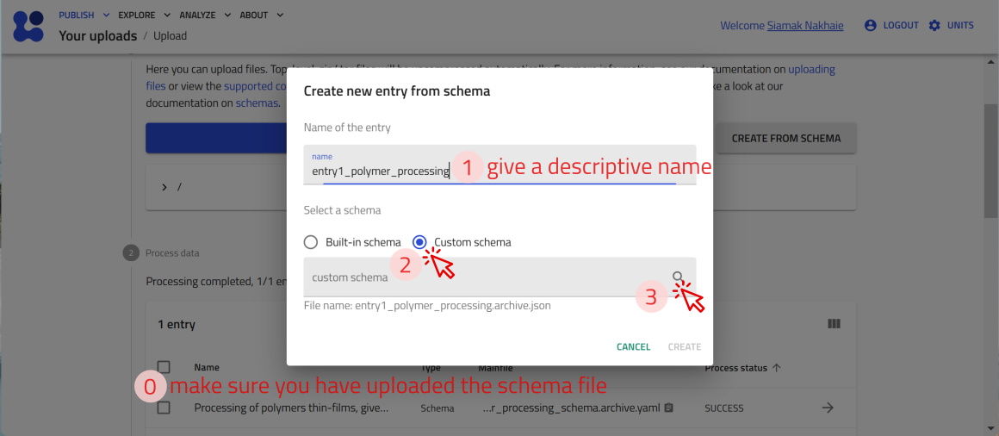
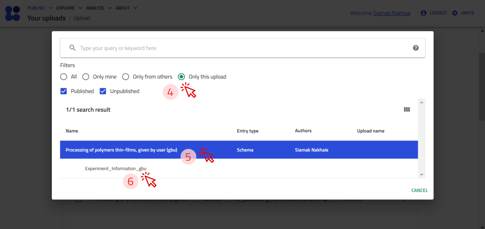
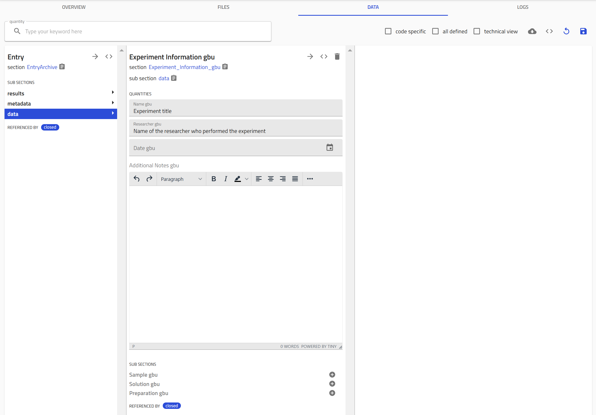
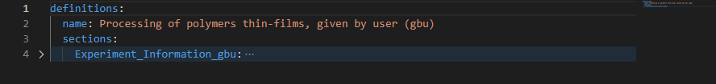
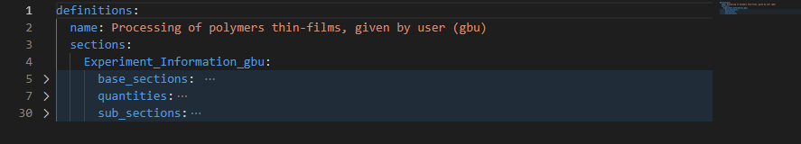
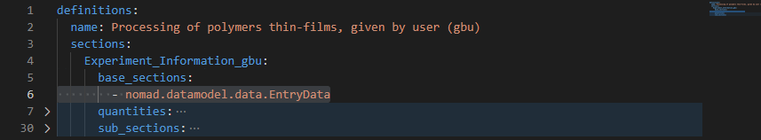
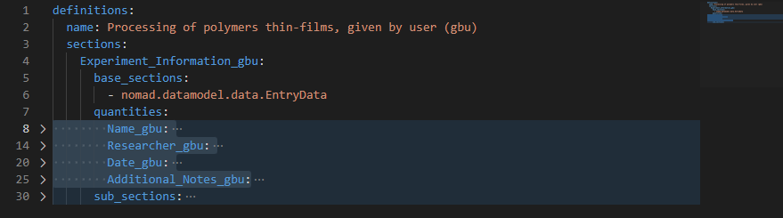
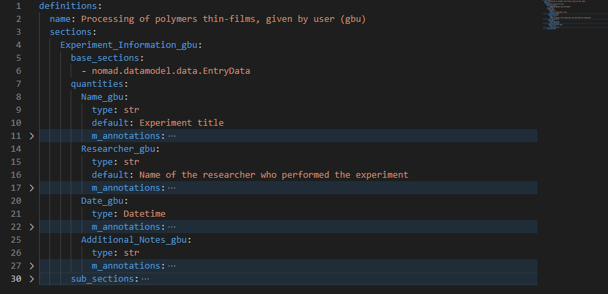
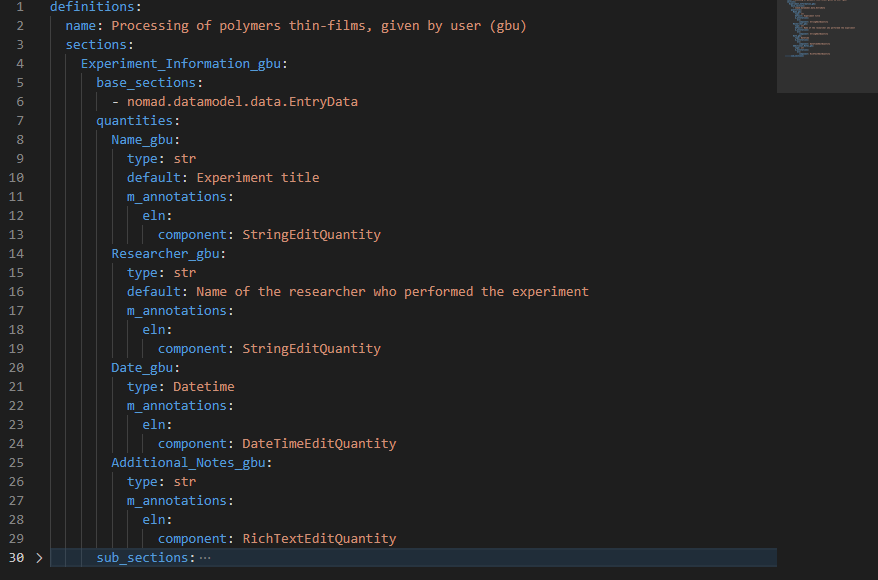
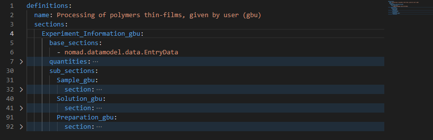

## Inspecting a Custom ELN in NOMAD GUI

In this part, we 
- Initially inspect an example custom ELN for polymer processing experiment in the NOMAD GUI together.
- Then, review the main six guidlines needed to write custom ELN schemas together.
- Finally, inspect the YAML file of the polymer processing example, and 

??? example "Example: Inspecting a custom ELN for polymer processing in NOMAD GUI"
    Now let's inspect a simple custom ELN for Polymer Processing together. You can find the **polymer_processing_schema.archive.yaml** file in [tutorial_16_materials/part_4_files](https://github.com/siamakn/temp_tutorial_16/tree/main/tutorial_16_materials){:target="_blank"} or download it [here](https://github.com/siamakn/temp_tutorial_16/blob/main/tutorial_16_materials/part_4_files/polymer_processing_schema.archive.yaml){:target="_blank"}. In order to see how it looks like in the NOMAD GUI, make a new upload, and drag and drop the *polymer_processing_schema.archive.yaml** file, so that NOMAD can process it. Then create a new entry, based on this schema (scrreenshots). 
    <div style="text-align: center;">
        
    </div>    
    <div style="text-align: center;">
        
    </div>       
    <div style="text-align: center;">
        
    </div>     

    After this, you will be able to see the custom ELN, opened in the DATA tab. You can take some moment and inspect different tabs, e.g., **OVERVIEW** tab and **DATA** tab, the quantities and the subsections we have here.
    <div style="text-align: center;">
        
    </div>    

## Guidelines for Building a Custom ELN Schema

To build a custom NOMAD ELN, you need to use the NOMAD metainfo schema language, primarily written in YAML. Your custom **schema file must have the ending extension** `.archive.yaml`

??? info "1. NOMAD's archive.yaml files start with the `definitions` keyword, and must have a `name`, and can have a `description`."
    
    NOMAD syntax is:
    ```yaml
    definitions:
      name:
      description:
    ```

    Example:
    ```yaml
    definitions:
      name: My NOMAD ELN
      description: This is an electronic lab notebook schema that includes several sections.
    ```
??? info "2. A schema can have several sections."

    NOMAD syntax is:

    ```yaml
    definitions:
      name:
      description: 

      sections:
        My_first_section:
        My_second_section:
        My_third_section:
    ```


??? info "3. Sections can inherit structure and definition from NOMAD's `base_sections` or other sections."
    When inheriting from a NOMAD base section, use the `base_sections` keyword and list the desired base sections you would like to inherit from. The keyword `base_sections` additionally allows you to also inherit from other sections (e.g., within the same schema or even a section that have been published in NOMAD, see [schema package references in NOMAD Documentation](https://nomad-lab.eu/prod/v1/docs/howto/customization/basics.html#schema-package-references){:target="_blank"}). Inherited sections can be given in a python list, or subsequent indented lines starting with a dash, `-`.

    Example:

    ```yaml
    definitions:
      name: My NOMAD ELN
      description: Custom ELN schema.

      sections:
        My_first_section:
          base_sections:
            - nomad.datamodel.data.EntryData
            - nomad.datamodel.metainfo.eln.Sample
  
        My_second_section:
        My_third_section:
    ```

    or alternatively in the form of a Python list:

    ```yaml
    definitions:
      name: My NOMAD ELN
      description: Custom ELN schema.

      sections:
        My_first_section:
          base_sections: ['nomad.datamodel.data.EntryData', 'nomad.datamodel.metainfo.eln.Sample']
  
        My_second_section:
        My_third_section:          
    ``` 

??? info "4. Each section can contain quantities, other sections, and subsections."
    Each section can contain a set of quantites that need to be captured by the ELN. The quantities represent the parameters of your measurement or processing conditions. In addition, sections **can also contain** subsections. When including subsections, you need to tell NOMAD the subsections you included are themselves a section. How? By including the keyword `sections:` in the next indented line (see bottom example). A list of editable quantities can be found [here](https://nomad-lab.eu/prod/v1/gui/dev/editquantity){:target="_blank"}.

    NOMAD syntax is:

    ```yaml
    definitions:
      name: My NOMAD ELN
      description: This is an electronic lab notebook schema that includes several sections.

      sections:
        My_first_section:
          base_sections:
            - nomad.datamodel.data.EntryData
            - nomad.datamodel.metainfo.eln.Sample
          quantities:

          sub_sections:
            My_first_subsection:
              sections:
            My_second_subsection:
              sections:      
        My_second_section:
    ```


??? info "5. Quantities can be defined with type, shape, unit and other properties"
    Quantities define possible primitive values. The basic properties that can go into a quantity definition are `type`, `shape`, and `unit`.

    ```yaml
    definitions:
      name: My NOMAD ELN
      description: This is an electronic lab notebook schema that includes several sections.

      sections:
        My_first_section:
          base_sections:
            - nomad.datamodel.data.EntryData
            - nomad.datamodel.metainfo.eln.Sample
          quantities:
            first_quantity:
              - type: #For example, str or np.float64
              - shape: #For example scalar or list (['*'])
              - unit: #For example, meters, amperes, or seconds
          sub_sections:
            My_first_subsection:
              sections:
            My_second_subsection:
              sections:
            My_third_subsection:
              sections:

        My_second_section:
        My_third_section:          
    ```

??? info "6. Section and quantities can have annotations"
    Annotations provide additional information that NOMAD can use to alter its behavior around these definitions and how users can interact with them. The keyword for annotations is `m_annotations`.

    ```yaml
    definitions:
      name: My NOMAD ELN
      description: This is an electronic lab notebook schema that includes several sections.
      
      sections:
        My_first_section:
          base_sections:
            - nomad.datamodel.data.EntryData
            - nomad.datamodel.metainfo.eln.Sample
          quantities:
            first_quantity:
              - type: #For example, str or np.float64
              - shape: #For example scalar or list (['*'])
              - unit: #For example, meters, amperes, or seconds
              m_annotations:
                annotation_name:
                  key1: value1  
              sub_sections:
                My_first_subsection:
                  sections:
                My_second_subsection:
                  sections:
                My_third_subsection:
                  sections:

        My_second_section:
        My_third_section:    
    ```


??? example "Example: Inspecting the YAML schema of the polymer processing ELN"
    Now let's inspect the [YAML schema file](https://github.com/siamakn/temp_tutorial_16/blob/main/tutorial_16_materials/part_4_files/polymer_processing_schema.archive.yaml){:target="_blank"} of the above custom Polymer Processing ELN together. We use vscode to show and edit this file.

    Here we started with `definitions:`, we have a `name:`, and don't have a `description` (guideline 1). A schema is a section itself, therefore having the keyword `sections:` (guideline 4).
    <div style="text-align: center;">
        
    </div>
    This schema has only one section: `Experiment_Information_gbu` (guideline 2).
    <div style="text-align: center;">
        
    </div>
    The `Experiment_Information_gbu` section inherits properties from some other sections that should be listed in `base_sections` (guideline 3), and contains quantities (keyword `quantities:`) and subsections (keyword `subsections:`) (guideline 4).
    <div style="text-align: center;">
        
    </div>
    The 'Experiment_Information_gbu' inherits from the NOMAD base section `nomad.datamodel.data.EntryData` (guideline 3). In order to have data becomming an entry in NOMAD, at least the `nomad.datamodel.data.EntryData` or other base sections that inherit from this base section should be given here.
    <div style="text-align: center;">
        
    </div>
    We defined four quantities for the `Experiment_Information_gbu` section: `Name_gbu`, `Researcher_gbu`, `Date_gbu`, and 'Additional_Notes_gbu' (guideline 4). We chose these names (given by the user or gbu); They are not NOMAD syntax.
    <div style="text-align: center;">
        
    </div>
    each of these quantities are defined with type (guideline 5), and have annotations (keyword: `m_annotations`, guideline 6).
    <div style="text-align: center;">
        
    </div>
    Let's inspect one of these quantities together, e.g., `Name_gbu:`. Look at the NOMAD syntax and try too read it like this: "I want a field to add a name for my experiment, it should be a piece of small text. I name this quantity something descriptive, e.g., `Name_gbu`, it should a text, so it will be of type `str`. Although optional, I want it to have some default value, e.g., to guide the user what it, or what it should be filled most often, so I define its default value in the next line `default: Experiment title`. I want it to be editable in the GUI. Therefore, I should define it further by annotations. Which annotation? I now now it is related to ELNs, and it is going to be an editable string quantity, so with some intuition and refering to NOMAD documentation and checking other schemas, I write, and care for the indentations.

    ```yaml
            Name_gbu:
          type: str  
          default: Experiment title
          m_annotations:
            eln:
              component: StringEditQuantity
    ```
    Now let's inspect what subsections does my `Experiment_Information_gbu` have.
    <div style="text-align: center;">
        
    </div>
    The `Experiment_Information_gbu` has 3 subsections, each of the 3 being a section itself (guideline 4), and therefore all the guidelines 2-6 apply to each of the 3 subsections, individually.


