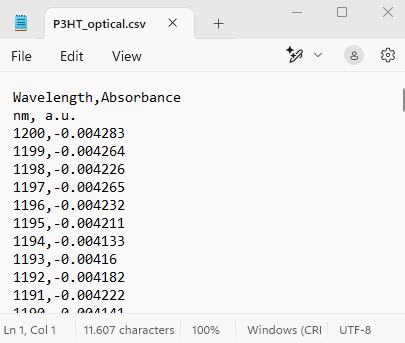

It is very common to export measurement data into a tabular format such as `.csv` or `.xlsx`. Following, we'll explore how to utilize NOMAD's **tabular parser** effectively to enhance our data documentation and visualization.

Our objectives are:

1. To upload our `.csv` or `.xlsx` data files onto NOMAD as **entries**, so that we can visualize and publish them and make it possible to get a DOI.
2. Enhance our custom schema by making NOMAD parse the data within these files, and then visualize the data in plots that can be viewed in our customized ELN. 


NOMAD offers a versatile tabular parser that can be configured to process tabular data with different representations:

- **Column Mode:** each column contains an array of cells that we want to parse into one quantity. Example: current and voltage arrays to be plotted as x and y.
  
- **Row Mode**: each row contains a set of cells that we want to parse into a section, i.e., a set of quantities. Example: an inventory tabular data file (for substrates, precursors, or more) where each column represents a property and each row corresponds to one unit stored in the inventory.

More details on the different representations of tabular data can be found in [NOMAD documentation on how to parse tabular data](https://nomad-lab.eu/prod/v1/staging/docs/howto/customization/tabular.html){:target="_blank"}.

## Steps to Utilize NOMAD's Tabular Parser for `.csv` Data

We use an example `.csv` file, which is the output of an optical absorption instrument. You can find the **P3HT_optical.csv** file in [tutorial_16_materials/part_4_files](https://github.com/siamakn/temp_tutorial_16/tree/main/tutorial_16_materials){:target="_blank"} or download it [here](https://github.com/siamakn/temp_tutorial_16/blob/main/tutorial_16_materials/part_4_files/P3HT_optical.csv){:target="_blank"}. We open this file using Notepad and have a quick look:

<div style="text-align: center;">
    
</div>

In this `.csv` file:

- Headers are **Wavelength** and **Absorbance**.
- Line 2 gives the units, that we will not need, because we manually define them in the schema.
- Then we have the values for Wavelength and Absorbance, in column mode, as an array.
- The seperator is: `,`

Knowing this, we continue to utilize the NOMAD parser with following steps.


### **Step 1: Defining and Saving the Schema File**

Let's start by creating a new schema file with the `.archive.yaml` format, and create a section called Optical_absorption.

```yaml
definitions:
  name: This is a parser for optical absorption data in the .csv format
  sections:
    Optical_absorption:
```

### **Step 2: Adding the Needed Base Sections**

The next step is to inherit the base sections to meet our ELN needs.

- To create entries from this schema we will use `nomad.datamodel.data.EntryData`
- To use the tabular parser we will use `nomad.parsing.tabular.TableData`
- To enable the plot function we will use `nomad.datamodel.metainfo.plot.PlotSection`

remember, the NOMAD syntax to include sections to inherit from, was `base_sections:`, and also care for the indentation, `base_sections` should be indented with respect to the 'Optical_absorption'.

```yaml
base_sections:
  - nomad.datamodel.data.EntryData
  - nomad.parsing.tabular.TableData
  - nomad.datamodel.metainfo.plot.PlotSection
```

### **Step 3: Defining the Quantities of Our Schema**

We will define the quantities in our ELN schema. Three quantities are needed, let's call them:

- **`data_file`** to upload the data file and apply the tabular parser.
- **`wavelength`** to store x-axis values extracted by the parser.
- **`absorption`** to tore y-axis values extracted by the parser.

and give them a proper type and shape attribute.

```yaml
quantities:
  data_file:
    type: str
  wavelength:
    type: np.float64
    unit: nm
    shape: ['*']
  absorbance:
    type: np.float64
    shape: ['*']
```

### **Step 4: Instructing NOMAD on How to Treat Different Quantities**

Remember, the syntax for this purpose was `m_annotations:`

* **The `data_file` quantity:**  

The first one is to instruct NOMAD to allow for droping and selecting files in this quantity. Here we will use the following: 

```yaml
eln:
  component: FileEditQuantity
```
The second one is to instruct NOMAD to open the operating system's data browser to select files:

```yaml
browser:
  adaptor: RawFileAdaptor
```
The third one instructs NOMAD to apply the tabular parser to extract the data from the uploaded file:
```yaml
tabular_parser:
  parsing_options:
    comment: '#'
    skiprows: [1]
  mapping_options:
    - mapping_mode: column
      file_mode: current_entry
      sections:
        - '#root'
```
The value of `skiprows` can be an integer (e.g., n) or a list of integers. If this is an integer, the parser skips that number of rows and starts from the next one (n+1). If this is a list (e.g., [m, n]), the parser skips the (m+1)th and (n+1)th rows (Python list). Here we have [1], meaning that the 2nd row (the units) will be skipped. We required that, because we needed capture the rest of the column as float numbers.

So we will annotate the `data_file` as following:

```yaml
m_annotations:
  eln:
    component: FileEditQuantity
  browser:
    adaptor: RawFileAdaptor
  tabular_parser:
    parsing_options:
      comment: '#'
      skiprows: [1]
    mapping_options:
      - mapping_mode: column
        file_mode: current_entry
        sections:
          - '#root'  
```


* **The `wavelength` quantity:**  
This quantitiy will accept values, that will be extracted by the tabular parser. Therefore the annotation will be:
```yaml
m_annotations:
  tabular:
    name: Wavelength
```
Note that the value for the `name` key **must** be exactly written as the **header of the column that we want to capture its values** and put in the `wavelength` quantity we defined in the schema.

* **The `absorbance` quantity:**  
```yaml
m_annotations:
  tabular:
    name: Absorbance
```
Again note that the value for the `name` key **must** be exactly written as the **header of the column that we want to capture its values** and put in the `absorbance` quantity we defined in the schema.

### **Step 5: Creating a Plot for Your Data**

To visualize the data from the uploaded and parsed file within the ELN, we will use an annotation for the **main section** of our schema `Optical_absorption`.
By using the `plotly_graph_object` annotation we instruct NOMAD which quanty should be used for the x-axis and which quanty for the y-axis (can also be several quantities, showing several curves in one plot), as well as provide the title of the plot. Within the plotly_graph_object annotation, the `data` key defines the quantites for each axis. Here, these varaiable names match those which are defined in the schema. Finally, plot's title is set using the `layout` key.

```yaml
m_annotations:
  plotly_graph_object:
    data:
      x: "#wavelength"
      y: "#absorbance"
    layout:
      title: Optical Spectrum
```
Note that here, the graph object belongs to the `Optical_absorption` section definition. Therefore, the `m_annotations:` **must be at the same hierarchy level as `quantities`, and `base_sections`**.

### **Step 6 (optional): Adding a Free Text Field**

If you only want to publish your data and graph, consider adding a short description.  
To do this, select a free text field from [editable quantities](https://nomad-lab.eu/prod/v1/gui/dev/editquantity){:target="_blank"} and add it to your schema.  

For example:

```yaml
info_about_data:
  type: str
  m_annotations:
    eln:
      component: RichTextEditQuantity
```

Finally our custom schema file should look like the following. You can also find the **optical_absorptoion_plot_schema.archive.yaml** file in [tutorial_16_materials/part_4_files](https://github.com/siamakn/temp_tutorial_16/tree/main/tutorial_16_materials){:target="_blank"} or download it [here](https://github.com/siamakn/temp_tutorial_16/blob/main/tutorial_16_materials/part_4_files/optical_absorption_plot.archive.yaml){:target="_blank"}.

```yaml
definitions:
  name: This is a parser for optical absorption data in the .csv format
  sections:
    Optical_absorption:
      base_sections:
        - nomad.datamodel.data.EntryData
        - nomad.parsing.tabular.TableData
        - nomad.datamodel.metainfo.plot.PlotSection
      quantities:
        info_about_data:
          type: str
          m_annotations:
            eln:
              component: RichTextEditQuantity          
        data_file:
          type: str
          m_annotations:
            eln:
              component: FileEditQuantity
            browser:
              adaptor: RawFileAdaptor
            tabular_parser:
              parsing_options:
                comment: '#'
                skiprows: [1]
              mapping_options:
                - mapping_mode: column
                  file_mode: current_entry
                  sections:
                    - '#root'
        wavelength:
          type: np.float64
          unit: nm
          shape: ['*']
          m_annotations:
            tabular:
              name: Wavelength
        absorbance:
          type: np.float64
          shape: ['*']
          m_annotations:
            tabular:
              name: Absorbance
      m_annotations:
        plotly_graph_object:
          data:
            x: "#wavelength"
            y: "#absorbance"
        layout:
          title: Optical Spectrum
```

### **Step 7: Uploading the Schema File to NOMAD and Creating an Entry**

Now that we have created the ELN schema file for parsing the optical absorption data file, let's put it to the test in the NOMAD GUI.

??? example "Example: Adding Plot to the Polymer Processing custom schema (Steps)"

    Now, let's enhance our Polymer Processing schema to include the tabular parser and the plot. 
    We already made the following custom schema  **polymer_processing_schema.archive.yaml**. You simply copy the snippet or download it [here](https://github.com/siamakn/temp_tutorial_16/blob/main/tutorial_16_materials/part_4_files/polymer_processing_schema.archive.yaml){:target="_blank"}. 

    ```yaml
    definitions:
      name: Processing and characterization of polymers thin-films, given by user (gbu)
      sections:
        Experiment_Information_gbu:
          base_sections: 
            - nomad.datamodel.data.EntryData
          quantities:
            Name_gbu:
              type: str  
              default: Experiment title
              m_annotations:
                eln:
                  component: StringEditQuantity 
            Researcher_gbu:
              type: str
              default: Name of the researcher who performed the experiment
              m_annotations:
                eln:
                  component: StringEditQuantity
            Date_gbu:
              type: Datetime
              m_annotations:
                eln:
                  component: DateTimeEditQuantity
            Additional_Notes_gbu:
              type: str
              m_annotations:
                eln:
                  component: RichTextEditQuantity
          sub_sections:
            Sample_gbu:
              section:
                base_sections:
                  - nomad.datamodel.data.EntryData
                  - nomad.datamodel.metainfo.eln.Sample
                m_annotations:
                  eln:
                    overview: true
                    hide: ['chemical_formula']
            Solution_gbu:
              section:
                base_sections:
                  - nomad.datamodel.data.EntryData
                  - nomad.datamodel.metainfo.eln.Sample
                m_annotations:
                  eln:
                    overview: true
                    hide: ['chemical_formula', 'description']
                quantities:
                  Concentration_gbu:
                    type: np.float64
                    unit: mg/ml
                    m_annotations:
                      eln:
                        component: NumberEditQuantity
                sub_sections:
                  Solute:
                    section:
                      base_sections:
                        - nomad.datamodel.data.EntryData
                      quantities:
                        Substance_gbu:
                          type: nomad.datamodel.metainfo.eln.ELNSubstance
                          m_annotations:
                            eln:
                              component: ReferenceEditQuantity
                        Mass_gbu:
                          type: float
                          unit: kilogram
                          m_annotations:
                            eln:
                              component: NumberEditQuantity
                              defaultDisplayUnit: milligram
                  Solvent_gbu:
                    section:
                      base_sections: 
                        - nomad.datamodel.data.EntryData
                      quantities:
                        substance_gbu:
                          type: nomad.datamodel.metainfo.eln.ELNSubstance
                          m_annotations:
                            eln:
                              component: ReferenceEditQuantity
                        Volume_gbu:
                          type: float
                          unit: meter ** 3
                          m_annotations:
                            eln:
                              component: NumberEditQuantity
                              defaultDisplayUnit: milliliter
            Preparation_gbu:
              section:
                base_sections:
                  - nomad.datamodel.data.EntryData
                  - nomad.datamodel.metainfo.eln.Process  
                m_annotations:
                  eln:
                    overview: true
    ```

    We can add the tabular parser and the plot in various places. Here, for the sake of simplicity, we add it as a subsection of the main section, at the same hierarchy level of `Sample_gbu`, `Solution_gbu`, and `Preparation_gbu`. Since it will be itself a section (subsection is a section itself), we should give a section definition using the key `section:` (see guideline 4 for building custom ELN schemas).

       ```yaml
       Optical_absorption:
         section:
       ```  
      and then copy and paste everything else (starting from 'base_sections:'), one level indented with respect to `section:`. Optionally, we can benefit from a **more specialized** NOMAD base section `nomad.datamodel.metainfo.basesections.Measurement` instead of `nomad.datamodel.data.EntryData`. This gives us more functionalities than just making an entry.


    You can also find the **polymer_processing_and_optical_absorptoion_plot_schema.archive.yaml** file in [tutorial_16_materials/part_4_files](https://github.com/siamakn/temp_tutorial_16/tree/main/tutorial_16_materials){:target="_blank"} or download it [here](https://github.com/siamakn/temp_tutorial_16/blob/main/tutorial_16_materials/part_4_files/polymer_processing_tabular_parser_optical_absorption.archive.yaml){:target="_blank"}.