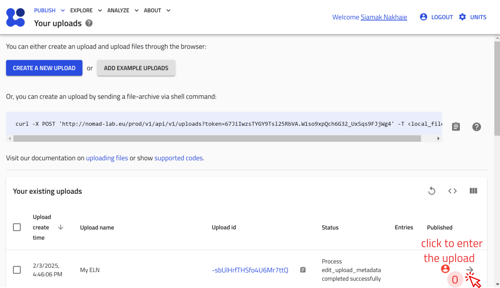
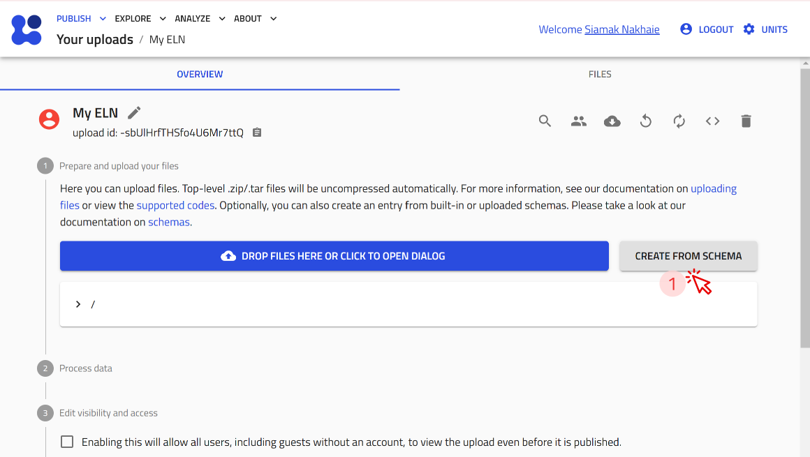
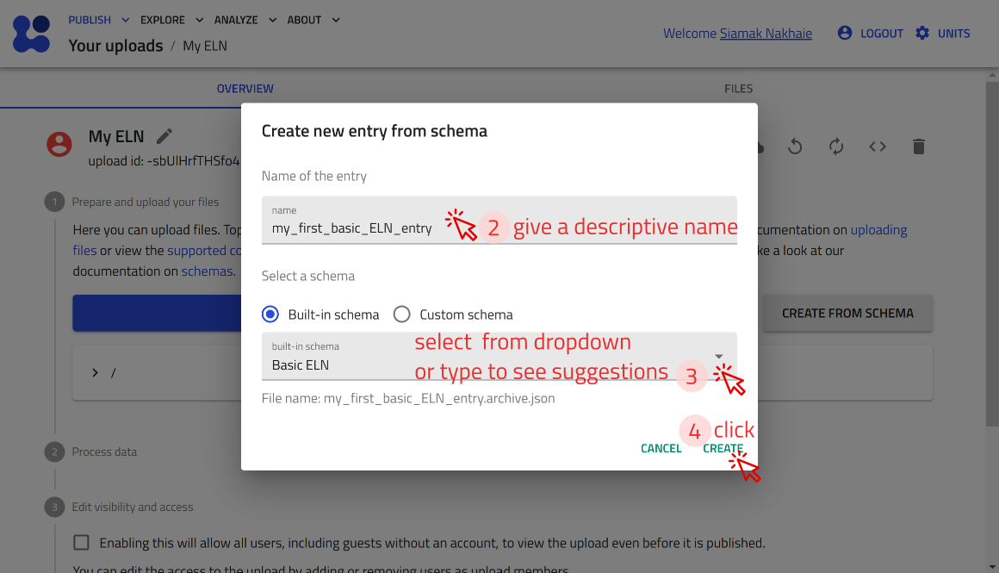

### Create a New Upload

On any page in NOMAD, click **PUBLISH**-> click **Uploads**-> click **CREATE A NEW UPLOAD** -> edit/give name -> click **SAVE**.

    

    

    

    

### Create an Entry Using NOMAD's Built-in Schema:
 Open the upload you just created or [create a new upload.](#create-a-new-upload) -> click **CREATE FROM SCHEMA** -> give a descriptive name, select your desired built-in schema from dropdown or type to see suggestions -> click **CREATE**.

    

    

    

