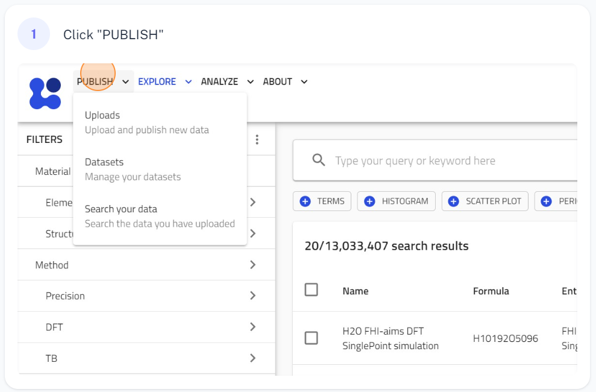
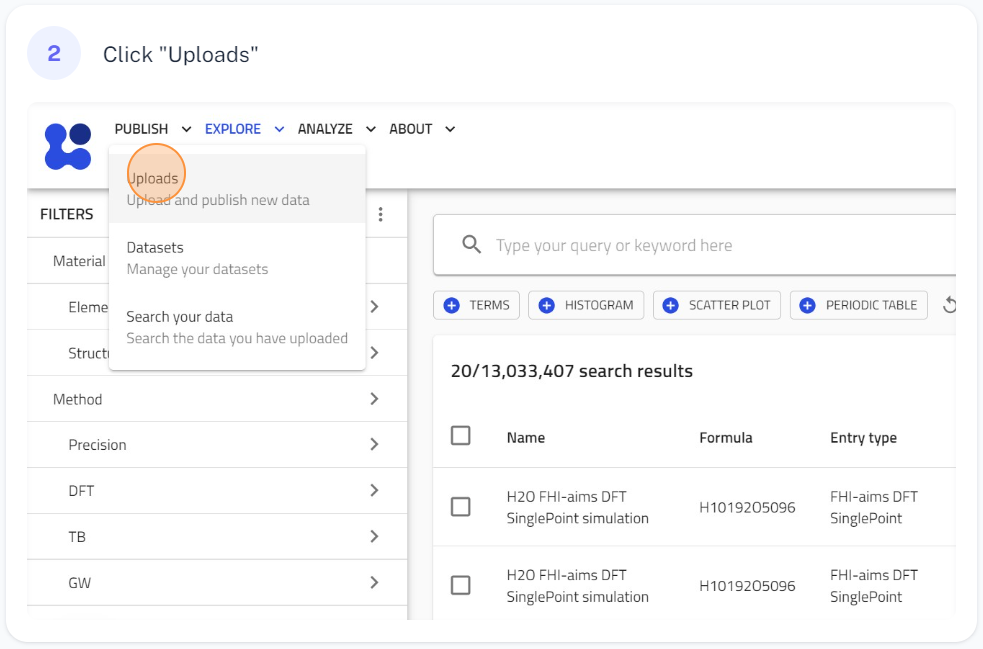
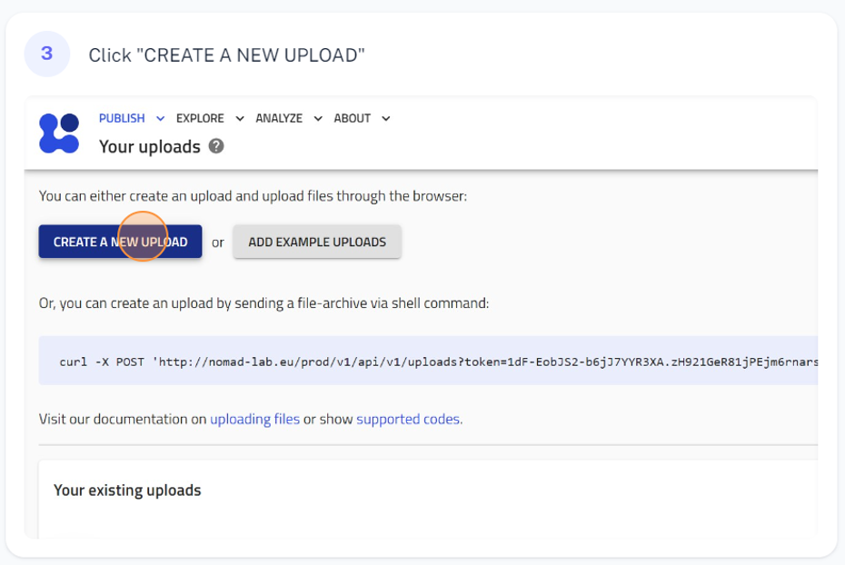
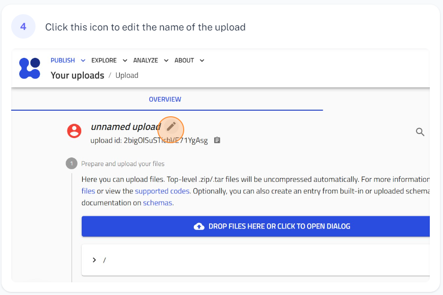
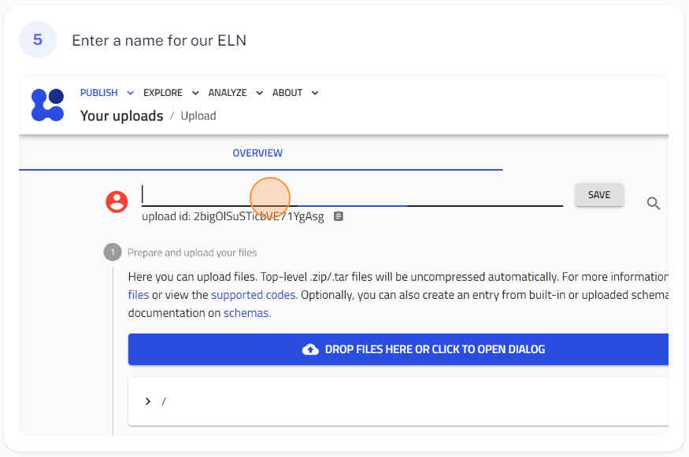
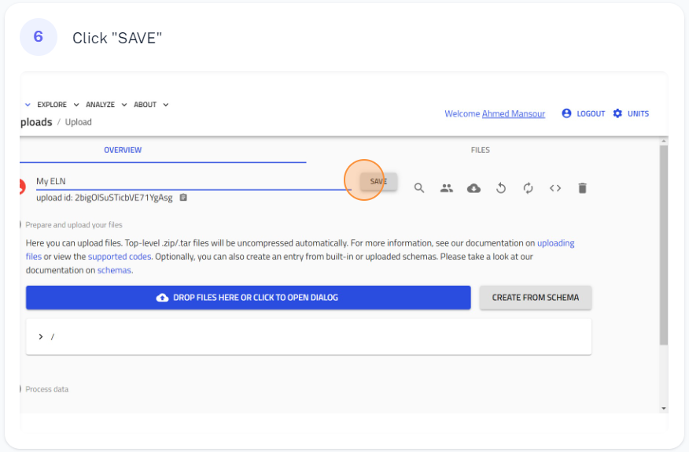
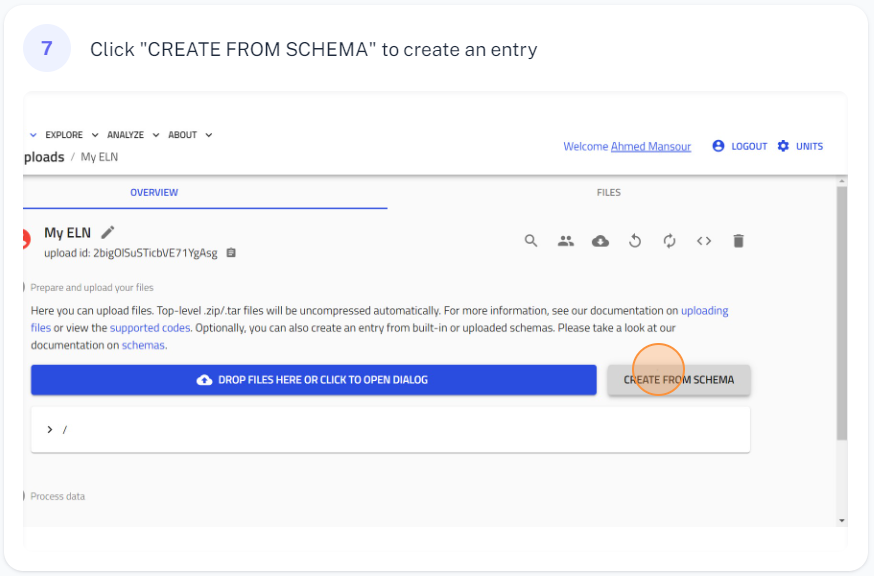
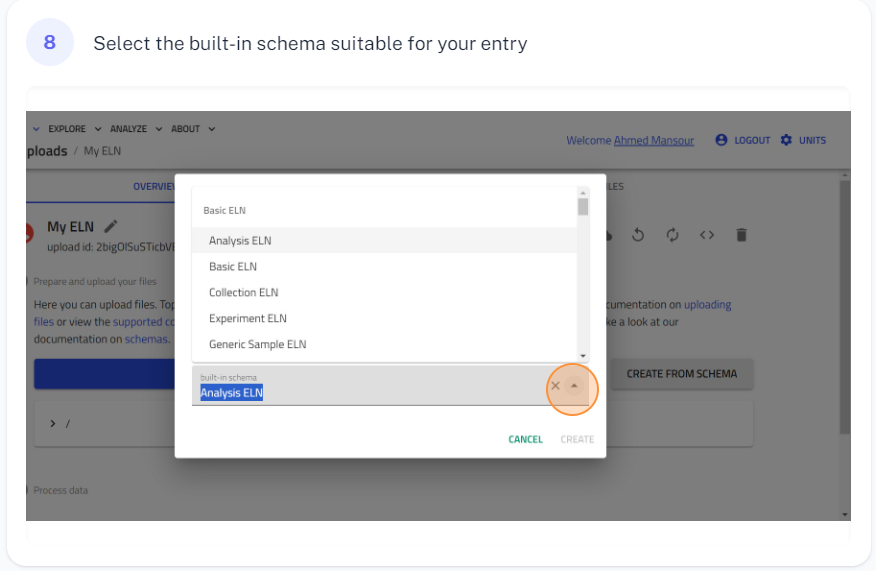
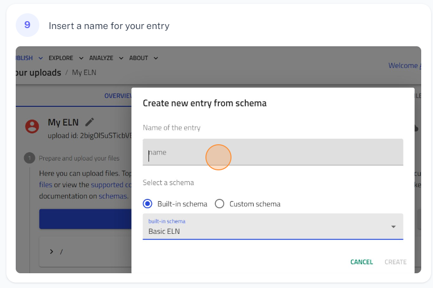
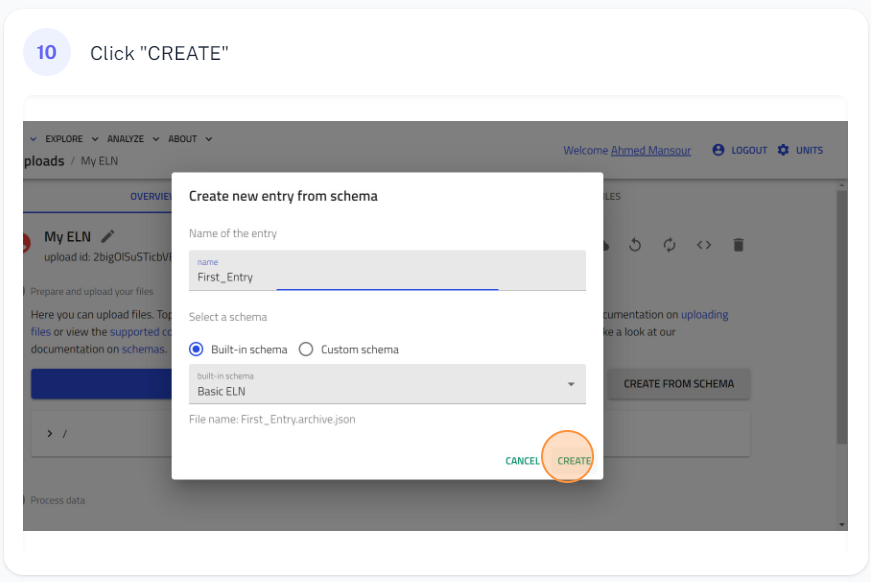

### Creating Entries Using Built-in ELN Schemas

To create an entry in NOMAD using a built-in ELN schema, you may follow these steps. For this example, we select the *Basic ELN* built-in schema in Step 8, which provides a free-text field. Alternatively, you can choose other built-in schemas from a list, depending on your needs.

#### Steps to Create a New Upload:
1. **Step 1:** Create a new upload for the electronic lab notebook for your experiments.  
   

2. **Step 2:** Click on the upload card to open it.  
   

3. **Step 3:** Click on the pen icon to provide a name for your upload.  
   

4. **Step 4:** Provide a descriptive name for your upload.  
   

5. **Step 5:** Click save to save the upload.  
   

---

#### Steps to Create an Entry Using NOMAD's Built-in Schema:
6. **Step 6:** Open the upload you just created.  
   

7. **Step 7:** Select a built-in schema (e.g., *Basic ELN*).  
   

8. **Step 8:** Choose the schema from the list.  
   

9. **Step 9:** Provide a name for your entry.  
   

10. **Step 10:** Click the "CREATE" button to save your entry.  
    

---

